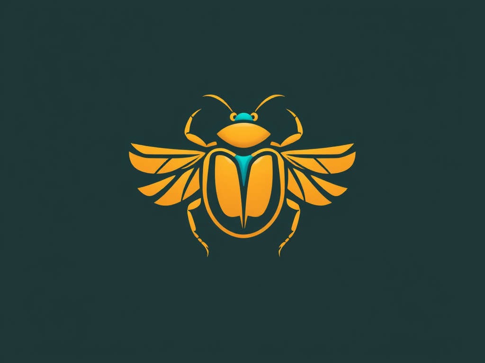

# 🪲 Project Scarab: A Portal to the Legends of Ancient Egypt

## 🚀 Introduction

Project Scarab is an engaging encyclopedia and resource hub dedicated to Egyptian mythology. Its primary goal is to educate a wide audience about the fascinating myths and deities of ancient Egypt. By using simple language and accessible explanations, Project Scarab ensures that everyone, regardless of their background, can understand and appreciate this rich cultural heritage. The platform provides a variety of resources, making it easy for users to navigate the complexities of Egyptian mythology. Whether you're a student, a casual reader, or a mythology enthusiast, Project Scarab serves as your go-to guide for exploring the wonders of ancient Egypt.

## 📖 Table of Contents

- 🐪 <a href="https://github.com/landyzhuo/projectscarab/blob/main/README.md#-why-egyptian-mythology">Why Egyptian Mythology?</a>
- 🧑🏻‍🎓 <a href="https://github.com/landyzhuo/projectscarab/blob/main/README.md#-about-us">About Us</a>
- 📝 <a href="https://github.com/landyzhuo/projectscarab/blob/main/README.md#-license">License</a>
- 🤝 <a href="https://github.com/landyzhuo/projectscarab/blob/main/README.md#-contributing">Contributing</a>
- ✉️ <a href="https://github.com/landyzhuo/projectscarab/blob/main/README.md#-contacts">Contacts</a>
- 🙋🏻‍♂️ <a href="https://github.com/landyzhuo/projectscarab/blob/main/README.md#list-of-contributors">List of Contributors</a>

## 🐪 Why Egyptian Mythology?

## 🧑🏻‍🎓 About Us

## 📝 License

## 🤝 Contributing

## ✉️ Contacts

## 🙋🏻‍♂️ List of Contributors
